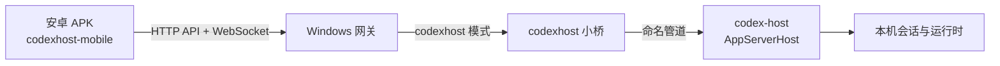

# codexhost-mobile

[](https://github.com/unlgame/codexhost-mobile/actions/workflows/build-android.yml)
[](https://github.com/unlgame/codexhost-mobile/actions/workflows/secret-guard.yml)
[](https://github.com/unlgame/codexhost-mobile/actions/workflows/build-ios.yml)
[](https://www.npmjs.com/package/codexhost-mobile)
[](https://github.com/unlgame/codexhost-mobile/releases/latest)
[](LICENSE)


**把手机变成 Windows 上 codex-host 的外部 harness 终端。**

`codexhost-mobile` 是一个 Android 客户端：手机装上 APK，手填一次 Windows 网关地址，
就能在手机上查看、继续和管理跑在 Windows 上的真实 Codex 工作流。它不是把终端页面
缩小塞进 WebView，也不维护一套模拟 Codex 的聊天协议——前端针对触控重新设计，
业务数据仍来自真实的 codex-host `AppServerHost`。

[快速开始](#快速开始) · [系统架构](#系统架构) · [运行模式](#运行模式) ·
[签名与密钥](#签名与密钥) · [移动端构建](#移动端构建) · [项目结构](#项目结构) ·
[与上游的关系](#与上游的关系)

> 本项目是独立开源项目，与 OpenAI 官方没有隶属关系。

---

## 快速开始

### 1. Windows 前置条件

- Windows 主机上**正在运行 codex-host**（`AppServerHost` 已就绪，命名管道可连接）。
- 同一台 Windows 主机上已启动本仓库的网关。
- 手机与 Windows 主机处于同一网络，且防火墙放行了网关监听端口。

如果 codex-host 没有在运行，网关无法转发请求，App 会显示主机不可用。

### 2. 下载并安装客户端

从 [GitHub Releases](https://github.com/unlgame/codexhost-mobile/releases/latest) 下载：

CodexHostMobile-v<version>.apk
CodexHostMobile-v<version>.apk.sha256
CodexHostMobile-v<version>-unsigned.ipa
CodexHostMobile-v<version>-unsigned.ipa.sha256
```

下载后先校验完整性，再安装。首次安装需要在 Android 系统设置里允许本应用
「安装未知应用」；App 不支持静默安装。详细步骤见
[`install.md`](install.md)。

iOS 用户下载未签名 IPA 与 `.sha256`。IPA **未签名**，装到真机或上传 TestFlight 之前
仍需使用你自己的 Apple Developer 证书重新签名。

如果只想在电脑上用网关，也可以直接装 npm 包，不必下载 APK：

```bash
npm install -g codexhost-mobile
codexhost-mobile start
```

### 3. 首次配置


打开 App，进入「设备设置」，**手动填写** Windows 网关的完整地址（形如
`http://<Windows-主机地址>:<网关端口>/?token=<访问口令>`，具体值由你启动网关时决定）。

保存后 App 会自动探测 `/api/host`，完成一次握手验证，成功后即可在会话列表中看到
该主机的项目与会话。地址与访问口令只保存在手机本地存储中，不会提交到本仓库。

> 本客户端**不使用二维码配对**，避免把网关地址和访问口令暴露给摄像头、截图和日志。

---

## 系统架构



数据流向说明：

| 组件 | 职责 |
| --- | --- |
| 安卓 APK | 触控优化的前端，只负责展示与交互，不固化后端地址 |
| Windows 网关 | 提供静态前端、校验访问口令、提供控制面，并在客户端 WebSocket 与 codexhost 小桥之间双向转发消息 |
| codexhost 小桥 | 把网关的转发请求接到本机 codex-host 通道上 |
| 命名管道 | 本机进程间通信，不暴露到网络 |
| AppServerHost | 真实的 Codex 运行时，持有会话、项目与工具调用 |

网关**不改写** codex-host 的业务协议，不复制或长期保存会话内容，也不建立第二套
会话数据库。

---

## 运行模式

### `CODEX_APP_SERVER_MODE=codexhost`（Windows 上的目标模式）

这是 codexhost 模式的入口。网关把上游指向本机的 codex-host 通道，经由命名管道
连接到 `AppServerHost`，由 codex-host 自行管理会话生命周期。

```bash
CODEX_APP_SERVER_MODE=codexhost \
codexhost-mobile start
```

注意 `CODEX_APP_SERVER_MODE` 的**代码默认值仍是 `managed`**（沿用上游，便于本机开发）；
Windows 上要连 codex-host 必须显式设成 `codexhost`。设错或 codex-host 没运行时，
网关启动后会一直报上游不可用。

小桥自己不拼管道名：它读取 codex-host 每次启动时原子发布的

```text
%LOCALAPPDATA%\codexhost\remote-control-bridge-v1.json
```

里面有 `ownerPid`、随机管道名和绝对路径。小桥只认这个文件里的 `pipePath`，并校验
`ownerPid` 仍然存活；codex-host 重启后文件会被替换，小桥随之重连到新管道。
排查「连不上」时先看这个文件在不在、`ownerPid` 是否还活着。

小桥下游默认监听 `127.0.0.1:18767`，可用 `CODEXHOST_BRIDGE_PORT` 覆盖；
下游全部断开后默认保留上游连接，以免丢会话。

### `managed`

网关自行启动并管理一个仅监听本机回环通道的 app-server 实例。适用于本机开发调试，
不经过 codex-host。

### `external`

连接一个已经在运行的 app-server，网关不管理其生命周期。

### `gateway-only`

APK 已内置前端时，后端只提供控制面与 WebSocket，根路径返回 `404`。
云端构建产出的 APK 属于这种形态。

---

## 签名与密钥

Android 出包使用 **release 签名**，keystore 只来自 GitHub Secrets，**永不入库**。

| Secret | 用途 |
| --- | --- |
| `CODEXHOST_MOBILE_KEYSTORE_BASE64` | keystore 文件的单行 base64 |
| `CODEXHOST_MOBILE_STORE_PASSWORD` | 打开 keystore 的 store 口令 |
| `CODEXHOST_MOBILE_KEY_ALIAS` | 证书条目别名 |
| `CODEXHOST_MOBILE_KEY_PASSWORD` | 使用私钥签名的 key 口令 |

配置位置：仓库 **Settings → Secrets and variables → Actions**。
四个 Secret 缺任何一个，构建都会明确失败，不会退化成 debug 签名。

> **keystore 与口令永不入库、永不进日志、永不在 issue 或 PR 贴出、永不提交到 fork。**
> 一旦泄漏必须重新生成并轮换密钥。Android 签名无法吊销，只能靠升级覆盖。

详细说明：

- [`docs/RELEASE.md`](docs/RELEASE.md) —— 签名与出包全流程、产物下载、泄漏处置
- [`docs/SECRETS.md`](docs/SECRETS.md) —— 四个 Secret 的用途、配置与轮换步骤
- [`docs/FORK.md`](docs/FORK.md) —— fork 后如何构建属于自己的 APK
- [`docs/android-signing.md`](docs/android-signing.md) —— 本地生成 keystore 与本地校验签名
- [`docs/CHANGELOG.md`](docs/CHANGELOG.md) —— 改名与 Android 化改动记录

`.github/workflows/secret-guard.yml` 会在每次 push / PR 自动扫描被跟踪文件，
一旦发现疑似签名密钥入库就让流水线失败。

---

---

## 移动端构建

[最新 GitHub Release](https://github.com/unlgame/codexhost-mobile/releases/latest) 提供：

- Android APK 及 SHA-256 校验文件；
- 未签名 iOS IPA 及 SHA-256 校验文件；
- 与同次发布版本号一致的 npm 包 `codexhost-mobile`。

Android App 会检查正式 Release，发现新版本后由用户确认下载，校验成功后调起系统
安装器。首次使用需要在 Android 系统中允许本应用安装未知应用，App 不支持静默安装。

iOS IPA 未签名，安装到真实设备或上传 TestFlight 前仍需使用 Apple Developer 证书
签名。

仓库使用固定提交的 PakePlus Android/iOS 项目作为原生容器，并把当前 `dist/` 静态
资源内置到 App。构建产物不包含局域网 IP、网关 Token 或其他私人配置。

发布流程：

- `main` 的应用相关代码变化会触发 Android、iOS 构建和 GitHub Release；
- npm 包只在网关、CLI 或包配置变化时随同发布，也可在手动工作流中显式启用；
- Android、iOS 与同次发布的 npm 包共用一个解析后的版本号。

相关工作流：

- [build-android.yml](.github/workflows/build-android.yml)
- [build-ios.yml](.github/workflows/build-ios.yml)
- [publish-npm.yml](.github/workflows/publish-npm.yml)
- [secret-guard.yml](.github/workflows/secret-guard.yml)

## 项目结构

```text
codexhost-mobile/
├── bin/                  # CLI 入口
├── src/                  # 前端：V2 客户端、会话恢复、分页、列表加载、UI
├── server/               # 网关、进程管理、项目目录读取、codexhost 小桥
├── protocol/             # app-server V2 协议基准与生成物
├── tests/                # 协议、服务端、UI、CI 与移动端测试
├── docs/                 # 设计、签名、Secrets、fork 与更新记录
└── .github/workflows/    # Android/iOS 出包流水线、npm 发布与密钥守卫
```

---

## 与上游的关系

本仓库是 [`loock-ai/codex-mobile`](https://github.com/loock-ai/codex-mobile) 的
下游分支。上游提供移动优先的 Codex Remote 客户端与网关通用能力；本仓库在此之上做了
Android 化、release 签名出包与密钥安全改造，并把产品定位收敛为
「Windows codex-host 的外部 harness 终端」。

主要差异：

- 应用相关代码仍会同时产出 Android APK 与未签名 iOS IPA，并随同发布 npm 网关包；
- 应用包名与品牌改为 `codexhost-mobile` / `ai.unlgame.codexhostmobile`；
- 增加 release 签名、密钥守卫与 `docs/` 下的签名/Secrets/fork 文档；
- 运行模式收敛到 `CODEX_APP_SERVER_MODE=codexhost`。

上游仍在维护的通用 Web 功能未被删除，只是本仓库的分发渠道已切换为
GitHub Releases 上的签名 APK、未签名 iOS IPA 与 npm 上的 `codexhost-mobile` 包。

---

## 安全与仓库边界

- 网关非回环监听必须配置访问口令；当前方案适用于可信局域网。
- 跨不可信网络使用时，应额外增加 HTTPS、可信反向代理和正式身份认证。
- 公开仓库与正式构建产物不包含局域网地址、访问口令、Codex 登录态、API 密钥、
  本机会话、用户项目内容或移动端签名材料。
- App 中保存的主机地址与访问口令位于手机本地存储，不会提交到本仓库。

---

## 致谢

Android 原生容器基于第三方开源项目 [PakePlus](https://github.com/Sjj1024/PakePlus-Android)
构建，前端资源由其打包为 APK。本项目对其构建产物做了 Manifest 权限裁剪、
`allowBackup=false`、FileProvider、签名注入与更新地址收敛等安全加固。
感谢上游项目与 PakePlus 的作者。

---

## 许可证

本项目使用 [Apache License 2.0](LICENSE)。
